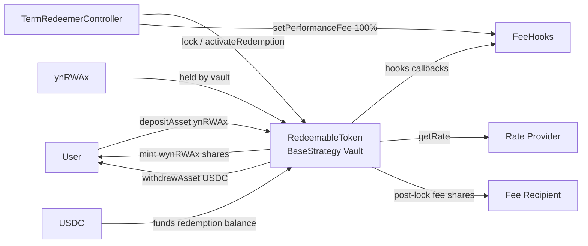
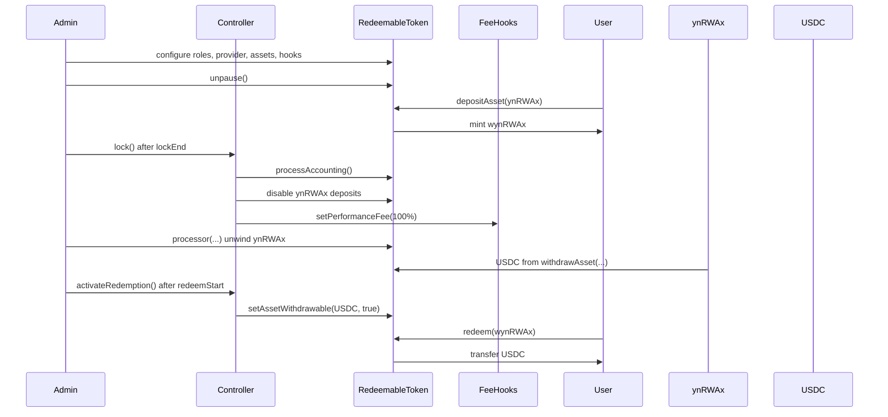

## Redeemable Token

This repo implements a term redemption system on top of YieldNest's `BaseStrategy`.

### Overview

The system has three main pieces:

- `RedeemableToken`
  - a `BaseStrategy` vault whose share token is the redeemable claim token
  - accepts `ynRWAx` as the deposit asset
  - uses `USDC` as the default redemption asset

- `TermRedeemerController`
  - controls the lifecycle after deployment
  - at `lockEnd`, it finalizes the lock stage by processing accounting once, disabling new `ynRWAx` deposits, and setting the vault fee hook to `100%` performance fee
  - at `redeemStart`, it activates `USDC` withdrawals

- `FeeHooks`
  - starts with `0%` performance fee
  - after lock, the controller sets it to `100%`
  - this allows `processAccounting()` to keep running while diverting post-lock gains to the fee recipient instead of changing redeemer economics

### Architecture



### Flow

1. The vault is deployed through the factory, initialized paused, and then configured atomically with roles, provider, assets, and hooks.
2. Users deposit `ynRWAx` into `RedeemableToken` and receive `wynRWAx`.
3. When the lock period is over, `lock()` is called on the controller:
   - accounting is processed once
   - `ynRWAx` is marked non-depositable
   - the performance fee is set to `100%`
4. After that point, later accounting gains are captured by the fee recipient, while holder redemption value remains stable.
5. When the redeem stage starts, `activateRedemption()` enables `USDC` withdrawals.
6. The vault can unwind held `ynRWAx` into `USDC`, and `wynRWAx` holders redeem against the funded `USDC` balance.

### Lifecycle



### Key Files

- `src/RedeemableToken.sol`
- `src/TermRedeemerController.sol`
- `script/common/RedeemableTokenDeployer.sol`
- `test/unit/TermRedeemer.t.sol`

### Commands

```sh
forge build
forge test
forge fmt
```

### Layout

- `src/`
  - production contracts
- `script/deploy`
  - production deployment scripts
- `script/test`
  - test harness deployment and lifecycle scripts
- `deployments/`
  - per-chain JSON deployment artifacts written by scripts
